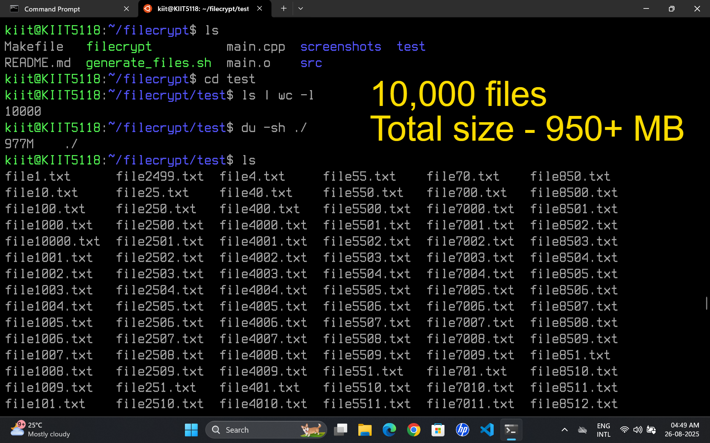
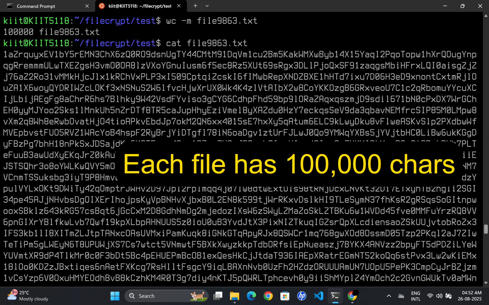
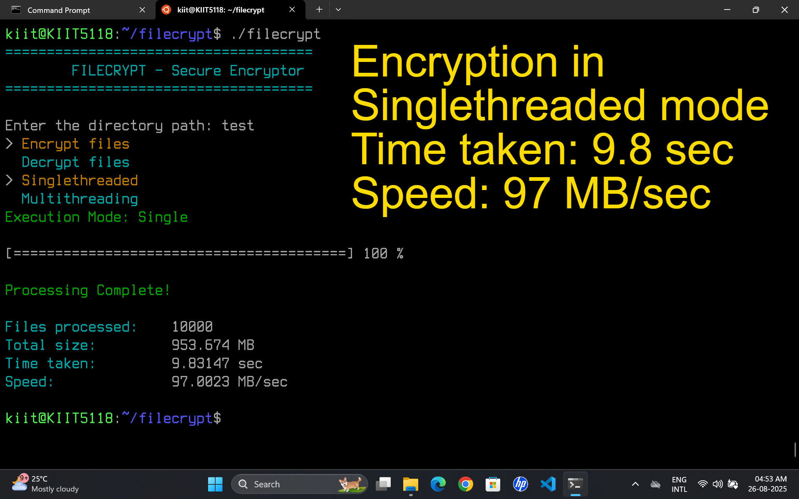
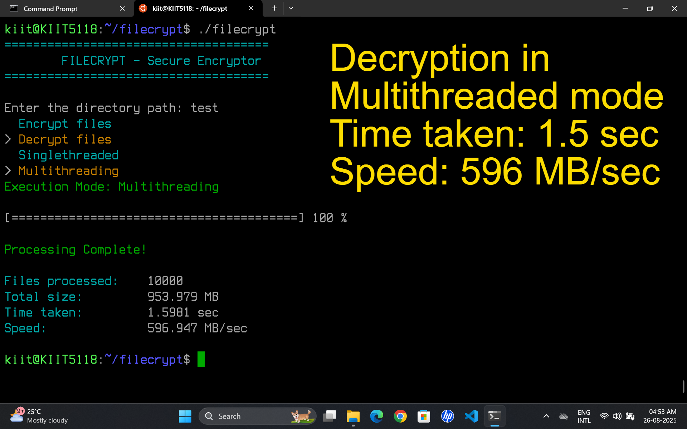

# FileCrypt 🔐  
A high-performance **parallel file encryption and decryption tool** written in **C++17**.  

FileCrypt is designed to handle encryption of large datasets efficiently by leveraging **multithreading**. It ensures speed, reliability, and scalability while keeping implementation lightweight and cross-platform (Linux).  

---


---

## ✨ Features  

- 🔒 **AES-based file encryption** (or custom algorithm — update if needed).  
- ⚡ **Parallel processing** — encrypt/decrypt multiple files simultaneously using threads.  
- 📂 **Recursive directory support** — encrypt entire folders at once.  
- 🛠 **Custom IO handling** for efficient file streaming.  
- 🐧 Built on **Linux (g++ / make)**  

---

## ⚙️ Tech Stack  

- **Language:** [C++17](https://en.cppreference.com/w/cpp/17)  
- **Build System:** [GNU Make](https://www.gnu.org/software/make/)  
- **Encryption:** [AES (256-bit)](https://en.wikipedia.org/wiki/Advanced_Encryption_Standard)  
- **Concurrency:** [std::thread](https://en.cppreference.com/w/cpp/thread/thread) (parallel file encryption)  
- **Platform:** [Linux](https://www.kernel.org/)  
 

---

## 🔥 Performance Benchmark  

Tested on **10,000 files**, each containing **100,000 characters** (total size: **950+ MB**):  

| Mode | Time | Throughput |
|------|------|------------|
| **Single-threaded encryption** | 9.8 sec | 97 MB/sec |
| **Multithreaded decryption** | 1.5 sec | 596 MB/sec |

> ✅ Achieved a **6× speedup** using multithreading.  

---

## 📐 Design  

This section outlines the low-level design of FileCrypt, showcasing the class structure and relationships.

```mermaid
classDiagram
    class Main {
        +printHeader()
        +showMenu() int
        +userInput() string
        +iterateFileSystem() vector~string~
        +progressBar(current : size_t, total : size_t)
        +createFileHandler(filePath : string) FileHandler*
        +createEncryptionTask(stream : fstream, act : Action, filePath : string) EncryptionTask*
        +executeCryption(taskData : string) int
        +submitToQueue(task : unique_ptr~EncryptionTask~) bool
        +printSummary(files : size_t, mbProcessed : double, duration : double, speed : double)
        .. Notes ..
        executeCryption() for single-threaded mode.
        submitToQueue() for multithreaded mode.
    }

    class Utilities {
        -RESET : string
        -RED : string
        -GREEN : string
        -YELLOW : string
        -CYAN : string
        -BOLD : string
        +printHeader()
        +showMenu(options : vector~string~) int
        +progressBar(current : size_t, total : size_t)
        +printSummary(files : size_t, mbProcessed : double, duration : double, speed : double)
        -moveCursorUp(n : int)
        -getKey() char
    }

    class FileHandler {
        -fileStream : fstream
        +FileHandler(filePath : string)
        +~FileHandler()
        +getFileStream() fstream
        +closeFile()
    }

    class Cryption {
        +getEnvKey() string
        +executeCryption(taskData : string) int
        -aesEncryptFile(inputFile : string, outputFile : string, keyStr : string) bool
        -aesDecryptFile(inputFile : string, outputFile : string, keyStr : string) bool
        .. Notes ..
        Relies on OpenSSL for AES-256-CBC encryption.
    }

    class EncryptionTask {
        -filePath : string
        -fStream : fstream
        -action : Action
        +EncryptionTask(stream : fstream, act : Action, filePath : string)
        +toString() string
        +fromString(taskData : string) EncryptionTask
    }

    class ThreadPool {
        -queueLock : mutex
        -threads : vector~thread~
        +ThreadPool(mode : string)
        +~ThreadPool()
        +submitToQueue(task : unique_ptr~EncryptionTask~) bool
        +waitForCompletion()
        +executeTasks(taskStr : string)
        .. Notes ..
        Supports multithreading with dynamic task queuing.
        Uses mutex for thread safety.
    }

    class Action {
        <<enumeration>>
        +ENCRYPT
        +DECRYPT
    }

    Main --> Utilities : uses
    Main --> FileHandler : creates *
    Main --> EncryptionTask : creates *
    Main --> ThreadPool : creates *
    ThreadPool --> EncryptionTask : manages *--
    ThreadPool --> Cryption : uses
    EncryptionTask --> FileHandler : uses
    Cryption --> FileHandler : uses
    ```

---

## 📸 Screenshots  

| | |
|---|---|
|  |  |
|  |  |

---

## 🛠 Setup / Installation

Follow these steps to build and run Filecrypt on your Linux system:

### Requirements
Before installing, make sure your system meets the following requirements:

- **Operating System:** Linux  
- **C++ Compiler:** g++ (supports C++17)  
- **Build System:** make  
- **OpenSSL Development Libraries:** Required for AES encryption  


### 1. Clone the Repository
```bash
git clone https://github.com/tusharAgarwal2511/FileCrypt.git
cd FileCrypt
```

### 2. Install Dependencies
```bash
sudo apt update
sudo apt install build-essential g++ make libssl-dev
```

### 3. Configure Encryption Key
Create a .env file in the project root and add your AES key.

### 4. Build the Project
```bash
make clean
make
```

### 5. Generate Test Files (Optional)
Edit the [`generate_files.sh`](generate_files.sh) script to customize the number of files and the size (in characters) of each file.
```bash
chmod +x generate_files.sh
./generate_files.sh
```

### 6. Run Filecrypt
After building, run the project using:

```bash
./filecrypt
```


